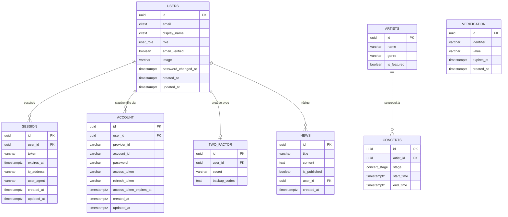

# Modèle Conceptuel de Données (MCD)

## Entités et associations



## Notation Merise (entités / associations / cardinalités)

```
USERS (id, email, display_name, role, email_verified, image, password_changed_at, created_at, updated_at)
SESSION (id, token, expires_at, ip_address, user_agent, created_at, updated_at)
ACCOUNT (id, provider_id, account_id, password, access_token, refresh_token, access_token_expires_at, created_at, updated_at)
VERIFICATION (id, identifier, value, expires_at, created_at)
TWO_FACTOR (id, secret, backup_codes)
NEWS (id, title, content, is_published, url_media, description_media, created_at)
ARTISTS (id, name, genre, origin, bio, url_media, description_media, youtube_url, spotify_url, is_featured)
CONCERTS (id, stage, start_time, end_time)

Associations :
USERS  (1,1) ────< POSSEDE >──── (0,N) SESSION
USERS  (1,1) ────< AUTHENTIFIE_PAR >──── (1,N) ACCOUNT
USERS  (1,1) ────< PROTEGE_PAR >──── (0,1) TWO_FACTOR
USERS  (0,1) ────< REDIGE >──── (0,N) NEWS
ARTISTS(1,1) ────< SE_PRODUIT >──── (0,N) CONCERTS
```

## Justification des cardinalités clés (nouveautés Phase 1)

- **USERS (1,1) — ACCOUNT (1,N)** : un utilisateur a *au minimum* une méthode d'authentification (credential = email/mot de passe) et peut en cumuler plusieurs (ex. ajout de Google en tâche 5), d'où le `(1,N)` côté ACCOUNT.
- **USERS (1,1) — TWO_FACTOR (0,1)** : le 2FA (tâche 4) est optionnel et ne concerne qu'un secret par utilisateur — cardinalité `(0,1)`.
- **VERIFICATION** n'est pas liée à USERS par une FK directe : elle référence un utilisateur par son `identifier` (email), conformément au fonctionnement des liens à usage unique de Better Auth (tâche 3).
- **USERS (1,1) — SESSION (0,N)** inchangé dans son principe par rapport au schéma actuel, mais la table `session` remplace `sessions`.
